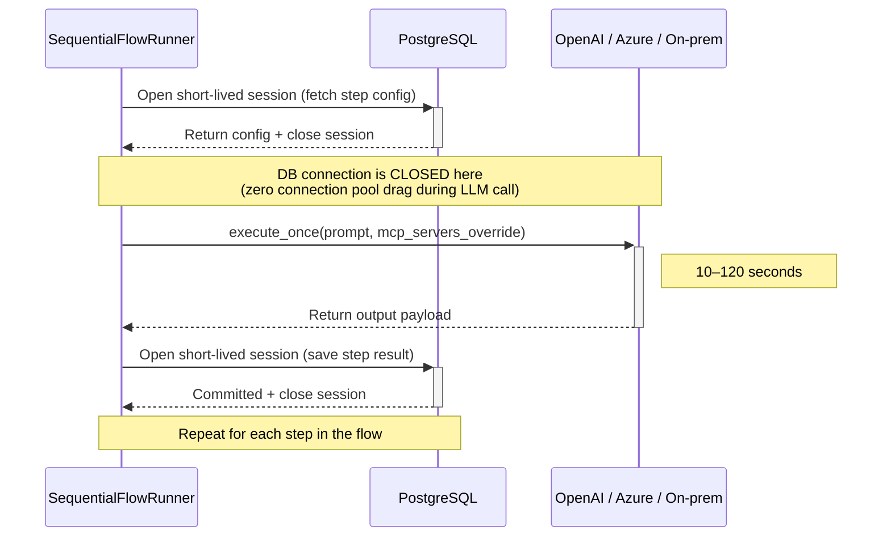

# Flöden — Flow Execution Engine

## Context

Eneo currently has Assistants (conversational), Apps (single-shot), and Group Chats (router). We need "Flöden" (Flows): sequential AI pipelines with per-step MCP allowlists, security classification, multimodal I/O, and inline creation UX.

**Non-breaking:** Flows are a NEW first-class resource. Existing APIs untouched.

**Design principles:**
- No mutation of `assistant.mcp_servers` in-place
- No user-visible sessions polluted by flow runs
- Explicit MCP allowlist semantics (membership = enabled)
- Security classification monotonic validation
- Data retention + file GC from day one
- **Flow is its own aggregate root** (not nested in Space)
- **Manual short-lived DB sessions** (no auto-transaction during LLM calls)
- **Inline builder with hidden assistants** (one-page UX)
- **Variable interpolation with JSON-safe escaping**
- **Svelte Flow visualizer for compliance/transparency** (read-only)
- **`prompt_override` (not `instructions_override`)** — matches actual `completion_service.get_response(prompt=...)` API

---

## Codebase Alignment (P0/P1 Required Fixes)

From actual codebase inspection with file:line references. P0 = blocks first commit. P1 = blocks production.

| # | Sev | Finding | Fix Applied |
|---|-----|---------|-------------|
| P0-1 | P0 | `@worker.task` wraps full body in `session.begin()` (`worker.py:445`) | `long_running_task` pattern in Worker section |
| P0-2 | P0 | `timeout=1800` not in decorator signature (`worker.py:431`) | ARQ `job_timeout` in config |
| P0-3 | P0 | It's `prompt`, not `instructions` (`assistant.py:281`, `completion_service.py:198`) | `prompt_override` everywhere in this doc |
| P0-4 | P0 | Non-streaming misses `tool_calls_metadata` (`tenant_model_adapter.py:415`) | Noted in data model + PR 2 |
| P0-5 | P0 | Security level is nested `.security_classification.security_level` | Fixed in all validation code |
| P1-6 | P1 | Step 1 defaults to `previous_step` = empty input | Validation rule added |
| P1-7 | P1 | Hidden filter breaks `get_space_by_assistant` (`space_repo.py:832,1329`) | Filter ONLY in list/UI |
| P1-8 | P1 | SessionProxy breaks in long-running (`container.py:1367`) | Runner uses `session_factory` |
| P1-9 | P1 | `delete_file` enforces owner check (`file_service.py:93`) | System-level GC path |
| P2-10 | P2 | `output_type=image\|audio` not feasible non-stream | V1: text\|json\|pdf\|docx only |

---

## Data Model

### Existing Table: Assistants (1 column added)

```
assistants (EXISTING — add one column)
├── ... (all existing columns unchanged)
└── hidden: bool (default False)                ← NEW
      True:  created by flow builder, filtered from Assistants UI
      False: normal (default, zero behavior change)
```

Migration: `ALTER TABLE assistants ADD COLUMN hidden BOOLEAN DEFAULT FALSE NOT NULL;`
Default list filter: `WHERE hidden = false`. Flow builder queries `WHERE hidden = true AND space_id = ?`.

### New Tables

```
flows
├── id, created_at, updated_at                  (BasePublic)
├── name: str
├── description: str | None
├── published: bool                             (default False)
├── insight_enabled: bool                       (default False)
├── data_retention_days: int | None
├── metadata_json: JSONB | None
│     {
│       "form_schema": [
│         {"id": "namn", "label": "Namn", "type": "text", "required": true},
│         {"id": "pnr", "label": "Personnummer", "type": "text", "required": true},
│         {"id": "ritning", "label": "Ritning", "type": "image", "required": true},
│         {"id": "ljud", "label": "Inspelning", "type": "audio", "required": false}
│       ],
│       "widget_config": {"widget_theme": "blue", "widget_welcome_text": "Hej!"}
│     }
│     Form field types: text | number | select | image | audio | document | file
│     Select: {"id":"x","label":"Y","type":"select","options":["A","B","C"]}
│     File fields → frontend renders upload dropzone. Value in form_data = file_id UUID.
├── space_id → spaces.id                        (CASCADE)
├── created_by_user_id → users.id               (SET NULL)
├── owner_user_id → users.id                    (SET NULL)
├── tenant_id → tenants.id                      (CASCADE)
├── icon_id → icons.id                          (SET NULL)
├── deleted_at: datetime | None                 (soft delete default)
├── UNIQUE(id, tenant_id)                       (required for composite tenant FK targets)
└── steps: relationship → flow_steps            (viewonly, order_by step_order)

flow_steps
├── id, created_at, updated_at                  (BasePublic)
├── flow_id → flows.id                          (CASCADE)
├── assistant_id → assistants.id                (RESTRICT)
│     Either hidden (inline builder) or pre-existing (linked specialist)
├── step_order: int
├── user_description: str | None                (step card header label)
├── input_source: str                           (default "previous_step")
│     flow_input | previous_step | all_previous_steps | http_get | http_post
│     ⚠️ P1-6: If step_order=1, API MUST reject previous_step/all_previous_steps.
│     Step 1 should default to flow_input. Validate at create/update time.
├── input_type: str                             (default "any")
│     text | json | image | audio | document | file | any
│     Drives frontend form rendering + step compatibility validation
├── input_contract: JSONB | None
│     Canonical contract for expected runtime input.
│     Example: {"type":"json","schema":{"required":["summary"]}}
├── output_mode: str                            (default "pass_through")
│     pass_through | http_post
├── output_type: str                            (default "text")
│     V1: text | json | pdf | docx
│     text:  pass through
│     json:  strip markdown blocks, validate
│     pdf:   markdown → PDF (DocumentGeneratorService, PR 7)
│     docx:  markdown → DOCX (DocumentGeneratorService, PR 7)
│     V2 (deferred per P2-10): image | audio
│     Non-stream completion returns text only; generated media needs stream/event handling.
├── output_contract: JSONB | None
│     Canonical contract for produced output.
│     Example: {"type":"json","schema":{"required":["patient_id","summary"]}}
├── input_bindings: JSONB | None
│     Explicit deterministic bindings from sources to step input fields.
│     Example:
│       {"summary":"{{step_2.output.summary}}","handler":"{{flow_input.handläggare}}"}
├── output_classification_override: int | None
│     NULL = inherit from model level. Use `is not None` check.
├── mcp_policy: str                             (default "inherit")
│     inherit | restricted
├── input_config: JSONB | None
│     http_get:  {"url": "...", "headers": {...}, "timeout_seconds": 10}
│     http_post: {"url": "...", "headers": {...}, "body": "{...}", "timeout_seconds": 10}
│     URL and body support {{variable}} interpolation.
│     ⚠️ HEADER ENCRYPTION: If Eneo has an existing encryption utility (Fernet/etc),
│       headers MUST be encrypted at rest. Decrypted only in worker at execution time.
│       If no utility exists: store plaintext with explicit doc note:
│       "Admin-only access. Least-privilege tokens. Encryption is V2 hardening."
│       → Check codebase before implementation.
├── output_config: JSONB | None                 (same encryption policy)
├── UNIQUE(flow_id, step_order)
└── UNIQUE(flow_id, id)                         (required for same-flow dependency composite FKs)

flow_step_mcp_tools                             (membership-based allowlist)
├── flow_step_id → flow_steps.id (CASCADE)  PK
└── mcp_server_tool_id → mcp_server_tools.id (CASCADE) PK

flow_step_dependencies                          (DAG edges, same-flow only)
├── flow_id → flows.id                          (CASCADE)
├── parent_step_id → flow_steps.id              (CASCADE)
├── child_step_id → flow_steps.id               (CASCADE)
├── UNIQUE(flow_id, parent_step_id, child_step_id)
├── CHECK(parent_step_id <> child_step_id)
└── Composite FKs:
      (flow_id, parent_step_id) → flow_steps(flow_id, id)
      (flow_id, child_step_id)  → flow_steps(flow_id, id)

flow_versions                                   (immutable published snapshots)
├── flow_id → flows.id                          (CASCADE)
├── version: int                                (monotonic per flow)
├── definition_checksum: str
├── definition_json: JSONB
│     Immutable snapshot of runtime-relevant flow definition:
│       flow metadata + ordered step definitions with:
│       step_id, step_order, assistant/model/prompt, MCP config,
│       input/output configs, contracts, bindings, classification override
├── created_at: datetime
└── UNIQUE(flow_id, version)

flow_runs
├── id, created_at, updated_at                  (BasePublic)
├── flow_id → flows.id                          (CASCADE)
├── tenant-flow integrity FK: (flow_id, tenant_id) → flows(id, tenant_id)
├── flow_version: int                           (immutable execution pin)
│     FK (flow_id, flow_version) → flow_versions(flow_id, version)
├── user_id → users.id                          (SET NULL)
├── tenant_id → tenants.id                      (CASCADE)
├── status: str                                 (queued | running | completed | failed | cancelled)
├── cancelled_at: datetime | None
├── input_payload_json: JSONB | None
│     {
│       "text": "free-text or empty",
│       "file_ids": ["uuid1", "uuid2"],
│       "form_data": {"namn": "Anna", "pnr": "198507121234", "ritning": "uuid1"}
│     }
├── output_payload_json: JSONB | None
├── error_message: str | None
├── job_id → jobs.id (SET NULL)                 (optional correlation id for shared telemetry)
├── UNIQUE(id, tenant_id)                       (required for composite tenant FK targets)
├── UNIQUE(id, flow_id)                         (required for same-flow execution FKs)
└── step_results: relationship, job: relationship

flow_step_results
├── id, created_at, updated_at                  (BasePublic)
├── flow_run_id → flow_runs.id                  (CASCADE)
├── flow_id → flows.id                          (CASCADE)
├── tenant_id → tenants.id                      (CASCADE)
├── tenant-run integrity FK: (flow_run_id, tenant_id) → flow_runs(id, tenant_id)
├── same-flow run FK: (flow_run_id, flow_id) → flow_runs(id, flow_id)
├── step_id → flow_steps.id                     (SET NULL)
├── same-flow step FK: (flow_id, step_id) → flow_steps(flow_id, id)
├── step_order: int (NOT NULL, display/sorting only)
├── assistant_id → assistants.id                (SET NULL)
├── input_payload_json: JSONB | None
├── effective_prompt: str | None                (post-interpolation prompt sent to model)
├── output_payload_json: JSONB | None
│     {"text":"...","file_ids":[...],"generated_file_ids":[...],"webhook_delivered":false}
├── model_parameters_json: JSONB | None
│     Resolved effective runtime parameters captured at execution time (not just configured defaults),
│     e.g. {"model_id":"...","provider":"...","temperature":0.2,"top_p":1.0,"max_tokens":4096}
├── num_tokens_input: int | None
├── num_tokens_output: int | None
├── status: str (default "pending")             (pending | running | completed | failed | cancelled)
├── error_message: str | None
├── flow_step_execution_hash: str | None
│     SHA256 over execution-critical fields:
│       flow_run_id + step_id + flow_version
│       + assistant_id + prompt text + completion_model.id
│       + canonical_json(model runtime parameters: temperature/top_p/max_tokens)
│       + mcp_policy + sorted(mcp_tool_allowlist when restricted)
│       + input_source + canonical_json(input_config)
│       + canonical_json(input_bindings)
│       + output_mode + output_type + canonical_json(output_config)
│       + output_classification_override
│       + canonical_json(input_contract) + canonical_json(output_contract)
│       + canonical normalized input-context hash
│     Excludes cosmetic fields (`user_description`, labels/icons, timestamps).
├── UNIQUE(flow_run_id, step_id)
└── tool_calls_metadata: JSONB | None
│     ⚠️ VERIFY: Check tenant_model_adapter.py for non-streaming capture gap.
│     Streaming path may populate this but non-streaming (our path) may not.

flow_step_attempts                              (append-only attempt history)
├── id, created_at                              (BasePublic)
├── flow_run_id → flow_runs.id                  (CASCADE)
├── flow_id → flows.id                          (CASCADE)
├── tenant_id → tenants.id                      (CASCADE)
├── tenant-run integrity FK: (flow_run_id, tenant_id) → flow_runs(id, tenant_id)
├── same-flow run FK: (flow_run_id, flow_id) → flow_runs(id, flow_id)
├── step_id → flow_steps.id                     (SET NULL)
├── same-flow step FK: (flow_id, step_id) → flow_steps(flow_id, id)
├── step_order: int (NOT NULL, display/sorting only)
├── attempt_no: int                             (1..n)
│     Allocation contract: `MAX()+1` is forbidden.
│     Use `self.request.retries + 1` (Celery-native) or a DB-atomic counter strategy.
├── celery_task_id: str | None
├── status: str                                 (started | retried | failed | completed | cancelled)
├── error_code: str | None
├── error_message: str | None
├── started_at: datetime
├── finished_at: datetime | None
└── UNIQUE(flow_run_id, step_id, attempt_no)
```

**Constraint rationale:**
- `step_id` in execution tables is a historical reference, not a structural dependency.
- `SET NULL` on `step_id` avoids sibling-cascade ordering conflicts during tenant/space/flow deletes.
- Tenant/run cascade still removes execution rows when deleting runs; `SET NULL` primarily protects integrity for step-definition lifecycle changes.
- Denormalized `flow_id` on execution tables is intentional for DB-level same-flow integrity:
  - result/attempt rows cannot reference a step from another flow even under service bugs.

**Migration:** 1 ALTER (assistants.hidden) + 9 CREATE TABLE.
Includes `flow_versions`, `flow_step_dependencies`, and `flow_step_attempts`. Register in `__init__.py`.

### Contract Schema Conventions (runtime-facing)

- JSON contracts use a documented JSON Schema Draft-07 compatible subset:
  - `type`, `required`, `properties`, `items`, `enum`, `additionalProperties`
- Non-JSON contracts (`text`, `image`, `audio`, `document`, `file`) use typed envelope metadata:
  - `type`, optional `format`, optional size/count constraints
- `input_bindings` expresses compile-time field wiring consumed by `FlowCompiler`.
- `{{...}}` interpolation remains runtime templating inside prompt/body/url fields after binding resolution.

---

## Critical Architectural Decision: Flow as Own Aggregate Root

**DO NOT** add `_set_flows` to `space_repo.py`.

The Space aggregate saves everything inside it recursively (`_set_apps`, `_set_group_chats`, etc). Adding flows would mean every Space update recursively saves all flow steps, MCP tools, and configs → massive write latency.

**Solution:** Dedicated `FlowRepository`:

```
backend/src/intric/flows/
├── infrastructure/
│   └── flow_repo.py           ← Own aggregate root. Standard CRUD.
```

```python
class FlowRepository:
    """Dedicated repository for Flow aggregate. NOT inside SpaceRepository."""

    # tenant_id is required in all repository methods (query-level tenant isolation).
    async def create(self, flow: Flow, tenant_id: UUID) -> Flow: ...
    async def get(self, flow_id: UUID, tenant_id: UUID) -> Flow: ...
    async def get_by_space(self, space_id: UUID, tenant_id: UUID) -> list[Flow]: ...
    async def get_sparse_by_space(self, space_id: UUID, tenant_id: UUID) -> list[FlowSparse]: ...
    async def update(self, flow: Flow, tenant_id: UUID) -> Flow: ...
    async def delete(self, flow_id: UUID, tenant_id: UUID) -> None: ...
    async def get_step_result(self, run_id: UUID, step_id: UUID, tenant_id: UUID) -> FlowStepResult | None: ...
    async def get_step_result_by_order(self, run_id: UUID, step_order: int, tenant_id: UUID) -> FlowStepResult | None: ...  # Legacy ARQ only
    async def save_step_result(
        self,
        run_id: UUID,
        result: FlowStepResult,
        tenant_id: UUID,
        session: AsyncSession | None = None,
    ) -> None: ...
```

**Space integration:** Space holds `flows: list[FlowSparse]` (id, name, description, published). Loaded via `FlowRepository.get_sparse_by_space()` during space hydration. NOT via `_set_flows`.

**Modify `space_factory.py`:** After building space, attach FlowSparse list.
**DO NOT modify `space_repo.py`** with `_set_flows`.

---

## Backend Package Structure

```
backend/src/intric/flows/
├── __init__.py
├── domain/
│   ├── entities/
│   │   ├── flow.py              # Flow, FlowStep, FlowSparse
│   │   └── flow_run.py          # FlowRun, FlowStepResult
│   └── factories/
│       ├── flow_factory.py
│       └── flow_run_factory.py
├── infrastructure/
│   └── flow_repo.py             # OWN AGGREGATE ROOT (not in space_repo)
├── application/
│   ├── flow_service.py          # CRUD + publish + classification validation
│   ├── flow_run_service.py      # queue, complete, fail, cancel
│   ├── flow_runner.py           # Legacy SequentialFlowRunner reference (ARQ-era)
│   └── variable_resolver.py     # build_context + interpolate (JSON-safe)
└── presentation/
    ├── models.py                # Pydantic schemas
    ├── flow_router.py           # includes graph endpoint
    ├── flow_run_router.py
    ├── assemblers/
    └── flow_run_worker.py       # Legacy ARQ task reference (flow runtime is Celery-first)
```

---

## Assistant Execution — Stateless Path

### Step A: `mcp_servers_override` + `prompt_override` on `Assistant.ask()`

```python
async def ask(self, ...,
    mcp_servers_override: list["MCPServer"] | None = None,
    prompt_override: str | None = None,
) -> tuple[ModelResponse, DatastoreResult]:
    effective_prompt = (
        prompt_override if prompt_override is not None
        else self.prompt
    )
    response = await self.completion_service.get_response(
        ...,
        mcp_servers=(mcp_servers_override if mcp_servers_override is not None
                     else self.mcp_servers),
        prompt=effective_prompt,  # P0-3: matches completion_service API (prompt, not instructions)
    )
```

**Why `prompt_override`:** `{{variables}}` in system prompt resolved at execution time. Original assistant entity never mutated.

### Step B: `execute_once()` on `AssistantService`

```python
async def execute_once(
    self,
    assistant_id: UUID,
    question: str,
    user: "UserInDB",
    mcp_servers: list["MCPServer"] | None = None,
    file_ids: list[UUID] | None = None,
    tracing_metadata: dict | None = None,
    prompt_override: str | None = None,
) -> ExecuteOnceResult:
    space = await self.space_repo.get_space_by_assistant(assistant_id=assistant_id)
    assistant = space.get_assistant(assistant_id=assistant_id)
    # permission + classification checks...
    files = await self.file_service.get_files_by_ids(file_ids) if file_ids else []
    response, _ = await assistant.ask(
        question=question, session=None, files=files,
        stream=False, require_tool_approval=False,
        mcp_servers_override=mcp_servers,
        prompt_override=prompt_override,
    )
    return ExecuteOnceResult(
        output=response.completion.text,
        num_tokens_input=response.total_token_count,
        num_tokens_output=count_tokens(response.completion.text),
        tool_calls_metadata=response.tool_calls_metadata,
    )
```

### Hidden Assistants

- Default assistant **list** endpoints: `WHERE hidden = false`
- `get_space_by_assistant()`: **MUST include hidden** (P1-7 — flow execution needs these)
- By-ID lookups: **MUST include hidden** (never filter on individual fetch)
- Flow builder creates with `hidden = true`
- Cleanup job (hourly): delete hidden assistants with no `flow_step` reference

---

## Variable Resolver (with JSON-safe escaping)

```python
import re, json
from typing import Any

def build_context(flow_run_params, all_results: list) -> dict:
    context = {
        "flow_input": {
            "text": flow_run_params.input_data or "",
            **(flow_run_params.form_data or {}),
        }
    }
    for result in all_results:
        out = result.output_payload_json or {}
        step_ctx = {
            "output": out.get("text", ""),
            "file_ids": ",".join(out.get("file_ids", [])),
        }
        try:
            parsed = json.loads(out.get("text", ""))
            if isinstance(parsed, dict):
                step_ctx["output"] = parsed
        except (json.JSONDecodeError, ValueError):
            pass
        # CRITICAL: Variable keys use step_order for human-readable prompts (e.g., {{step_1.output}}).
        # Execution identity (hashing, DB uniqueness) strictly uses step_id.
        # DAG phase migration note: keep human-readable step aliases stable across branches (do not expose UUIDs in prompts).
        context[f"step_{result.step_order}"] = step_ctx
    return context

def interpolate(text: str, context: dict, json_safe: bool = False) -> str:
    """Replace {{path.to.value}}.
    json_safe=True: escape quotes/backslashes/newlines for JSON string context."""
    def replacer(match):
        path = match.group(1).split(".")
        value: Any = context
        for key in path:
            if isinstance(value, dict):
                value = value.get(key, match.group(0))
            else:
                return match.group(0)
        if isinstance(value, (dict, list)):
            return json.dumps(value, ensure_ascii=False)
        result = str(value)
        if json_safe:
            result = result.replace('\\', '\\\\').replace('"', '\\"')
            result = result.replace('\n', '\\n').replace('\r', '\\r').replace('\t', '\\t')
        return result
    return re.sub(r'\{\{(\w+(?:\.\w+)*)\}\}', replacer, text)
```

**Usage:**
- System prompt: `interpolate(prompt, ctx, json_safe=False)`
- `input_config.body`: `interpolate(body, ctx, json_safe=True)` ← JSON context
- `input_config.url` / `output_config.url`: `interpolate(url, ctx, json_safe=False)`

---

## Resume Determinism (Execution Hash)

Use deterministic execution hashing so resume behavior only reacts to logic changes.

```python
def canonical_json(value) -> str:
    return json.dumps(value or {}, sort_keys=True, separators=(",", ":"), ensure_ascii=False)

def build_step_execution_hash(flow_run_id, flow_version, step, normalized_input_context_hash) -> str:
    restricted_tools = []
    if step.mcp_policy == "restricted":
        restricted_tools = sorted([str(tid) for tid in (step.mcp_tool_allowlist or [])])
    payload = {
        "flow_run_id": str(flow_run_id),
        "flow_version": flow_version,
        "step_id": str(step.id),
        "assistant_id": str(step.assistant.id),
        "prompt": step.assistant.prompt or "",
        "completion_model_id": str(step.assistant.completion_model.id),
        "model_parameters": canonical_json(get_effective_model_parameters(step.assistant)),
        "mcp_policy": step.mcp_policy,
        "mcp_tool_allowlist": restricted_tools,
        "input_source": step.input_source,
        "input_config": canonical_json(step.input_config),
        "input_contract": canonical_json(step.input_contract),
        "input_bindings": canonical_json(step.input_bindings),
        "output_mode": step.output_mode,
        "output_type": step.output_type,
        "output_config": canonical_json(step.output_config),
        "output_contract": canonical_json(step.output_contract),
        "output_classification_override": step.output_classification_override,
        "normalized_input_context_hash": normalized_input_context_hash,
    }
    canonical = json.dumps(payload, sort_keys=True, separators=(",", ":"), ensure_ascii=False)
    return hashlib.sha256(canonical.encode("utf-8")).hexdigest()
```

**Resume rules:**
- If any upstream step hash changed (or topology changed), force full rerun from Step 1.
- If upstream hashes are unchanged, resume from the first failed step.
- Cancelled runs are terminal and non-resumable. To retry, create a new run.
  This avoids ambiguity when cancellation races with external side effects (for example webhooks).

**Examples:**
- Cosmetic edit only (`user_description` typo fix): hash unchanged → no forced full rerun.
- Execution change (`prompt`, model, `input_config`, or `output_mode`): hash changed → full rerun from Step 1.

---

## SequentialFlowRunner (Manual DB Sessions, Legacy ARQ Reference)

This section is preserved as historical implementation context from the ARQ-era flow runner.
For new implementation, use the Celery runtime overlay in this document as the authoritative execution model.

**CRITICAL legacy lesson retained:** The runner must not hold a DB session during long LLM calls. Sessions are short-lived around persistence.

The following diagram shows the DB connection lifespan per step — the connection is **closed** during the 60+ second LLM call, preventing connection pool exhaustion:



```python
class SequentialFlowRunner:
    def __init__(self, assistant_service, flow_repo, file_service,
                 session_factory, doc_generator=None):
        self.assistant_service = assistant_service
        self.flow_repo = flow_repo
        self.file_service = file_service
        self.session_factory = session_factory  # creates short-lived DB sessions
        self.doc_generator = doc_generator

    async def _persist(self, flow_run_id, step_result, tenant_id):
        """Short-lived session: open → save → commit → close (milliseconds)."""
        async with self.session_factory() as session:
            await self.flow_repo.save_step_result(
                flow_run_id,
                step_result,
                tenant_id=tenant_id,
                session=session,
            )
            await session.commit()

    async def execute(self, flow, flow_run_id, flow_run_params, user):
        previous_result = None
        all_results = []
        context = build_context(flow_run_params, [])

        for step in sorted(flow.steps, key=lambda s: s.step_order):
            # ── Idempotency (ARQ retry) ──
            # Legacy ARQ reference: lookup by step_order.
            # Current Celery runtime MUST use get_step_result(run_id, step_id, tenant_id).
            existing = await self._get_step_result(flow_run_id, step.step_order, tenant_id=user.tenant_id)
            if existing and existing.status == "completed":
                # Retry webhook only if not delivered
                if step.output_mode == "http_post" and step.output_config:
                    delivered = (existing.output_payload_json or {}).get("webhook_delivered", False)
                    if not delivered:
                        url = interpolate(step.output_config["url"], context)
                        headers = self._decrypt_headers(step.output_config.get("headers", {}))
                        await self._safe_http_post(url, headers, existing.output_payload_json.get("text", ""))
                        existing.output_payload_json["webhook_delivered"] = True
                        await self._persist(flow_run_id, existing, tenant_id=user.tenant_id)
                previous_result = existing
                all_results.append(existing)
                context = build_context(flow_run_params, all_results)
                continue

            current_text, current_file_ids = "", []
            try:
                # 1. Resolve inputs
                current_text, current_file_ids = await self._resolve_inputs(
                    step, flow_run_params, previous_result, all_results, context)

                # 2. Token pre-check
                token_count = count_tokens(current_text)
                model_limit = step.assistant.completion_model.token_limit
                if model_limit and token_count > model_limit:
                    raise FlowStepError(f"Step {step.step_order}: {token_count} tokens > {model_limit} limit")

                # 3. Variable interpolation in system prompt
                resolved_prompt = interpolate(step.assistant.prompt or "", context, json_safe=False)

                # 4. MCP tools
                effective_mcp = self._resolve_step_mcp_tools(step)

                # 5. Execute (NO open DB transaction!)
                result = await self.assistant_service.execute_once(
                    assistant_id=step.assistant.id,
                    question=current_text, user=user,
                    mcp_servers=effective_mcp,
                    file_ids=current_file_ids,
                    tracing_metadata={"flow_run_id": str(flow_run_id), "step": step.step_order},
                    prompt_override=resolved_prompt,
                )

                # 6. Post-process
                out_text, out_file_ids = await self._process_output(step, result)

                # 7. Persist (short-lived DB session)
                step_result = FlowStepResult(
                    step_order=step.step_order, assistant_id=step.assistant.id,
                    input_payload_json={"text": current_text, "file_ids": current_file_ids},
                    effective_prompt=resolved_prompt,
                    output_payload_json={
                        "text": out_text, "file_ids": out_file_ids,
                        "generated_file_ids": out_file_ids, "webhook_delivered": False,
                    },
                    model_parameters_json=get_effective_model_parameters(step.assistant),
                    num_tokens_input=result.num_tokens_input,
                    num_tokens_output=result.num_tokens_output,
                    tool_calls_metadata=result.tool_calls_metadata,
                    status="completed",
                )
                try:
                    await self._persist(flow_run_id, step_result, tenant_id=user.tenant_id)
                except Exception:
                    for fid in out_file_ids:
                        await self.file_service.delete_file_system(fid, tenant_id=user.tenant_id)
                    raise

                # 8. Webhook
                if step.output_mode == "http_post" and step.output_config:
                    try:
                        url = interpolate(step.output_config["url"], context)
                        headers = self._decrypt_headers(step.output_config.get("headers", {}))
                        await self._safe_http_post(url, headers, out_text)
                        step_result.output_payload_json["webhook_delivered"] = True
                        await self._persist(flow_run_id, step_result, tenant_id=user.tenant_id)
                    except Exception as e:
                        raise FlowStepError(f"Step {step.step_order}: webhook failed: {e}")

                yield step_result
                previous_result = step_result
                all_results.append(step_result)
                context = build_context(flow_run_params, all_results)

            except Exception as e:
                failed = FlowStepResult(
                    step_order=step.step_order, assistant_id=step.assistant.id,
                    input_payload_json={"text": current_text, "file_ids": current_file_ids},
                    status="failed", error_message=str(e))
                await self._persist(flow_run_id, failed, tenant_id=user.tenant_id)
                raise
```

**Warning (anti-pattern to avoid in new implementation):**
The legacy ARQ reference above can overwrite or duplicate a successful LLM step when webhook delivery fails. The current contract is:
- Keep step result `completed` with `webhook_delivered=false` and `webhook_error`.
- Mark flow run (or delivery subtask) failed for retry/visibility.
- Never discard or overwrite expensive completed LLM output due to downstream delivery failure.

### MCP Tool Resolution (safe entity cloning)

```python
def _resolve_step_mcp_tools(self, step):
    if step.mcp_policy == "inherit":
        return None
    allowed_ids = {tid for tid in step.mcp_tool_allowlist}
    servers = []
    for orig in step.assistant.mcp_servers:
        server = _safe_copy(orig)
        for tool in server.tools:
            tool.is_enabled_by_default = tool.id in allowed_ids
        servers.append(server)
    return servers

def _safe_copy(obj):
    """Copy entity safely — works for both Pydantic models and domain entities.
    ⚠️ CODEBASE CHECK at implementation time:
      - If MCP servers are Pydantic v2: obj.model_copy(deep=True)
      - If domain entities: copy.deepcopy(obj)
      - Test that SQLAlchemy-loaded attrs don't raise DetachedInstanceError
    """
    if hasattr(obj, 'model_copy'):
        return obj.model_copy(deep=True)
    import copy
    return copy.deepcopy(obj)
```

### Input Resolution

```python
async def _resolve_inputs(self, step, params, previous_result, all_results, context):
    if step.input_source == "flow_input":
        text = params.input_data or ""
        file_ids = list(params.file_ids or [])
        if step.input_type in ("image", "audio", "document", "file"):
            for val in (params.form_data or {}).values():
                if isinstance(val, str) and _is_uuid(val) and val not in file_ids:
                    file_ids.append(val)
        return text, file_ids

    elif step.input_source == "all_previous_steps" and all_results:
        texts, all_files = [], []
        for prev in all_results:
            p = prev.output_payload_json or {}
            texts.append(f"<step_{prev.step_order}_output>\n{p.get('text','')}\n</step_{prev.step_order}_output>")
            all_files.extend(p.get("file_ids", []))
        return "\n".join(texts), all_files

    elif step.input_source == "previous_step" and previous_result:
        p = previous_result.output_payload_json or {}
        return p.get("text", ""), p.get("file_ids", [])

    elif step.input_source == "http_get" and step.input_config:
        url = interpolate(step.input_config["url"], context)
        headers = self._decrypt_headers(step.input_config.get("headers", {}))
        text, file_ids = await self._safe_http_get(url, headers)
        return text, file_ids

    elif step.input_source == "http_post" and step.input_config:
        url = interpolate(step.input_config["url"], context)
        body = interpolate(step.input_config.get("body", "{}"), context, json_safe=True)
        headers = self._decrypt_headers(step.input_config.get("headers", {}))
        text, file_ids = await self._safe_http_post_input(url, headers, body)
        return text, file_ids

    return "", []
```

### SSRF + HTTP features (both GET and POST)

- Block private IPs unless in `ALLOWED_INTERNAL_CIDRS`
- Block loopback/link-local always
- Header injection blocklist: Host, Connection, Content-Length, Transfer-Encoding
- 3 retries exponential backoff (1s, 2s, 4s)
- 1MB response cap, 30s timeout
- Content-type routing: text/json → string, binary → file_service → file_id
- `Idempotency-Key: sha256(flow_run_id + step_id)` on output webhooks

### Security Classification

```python
def validate_step_classification(flow):
    """Called on flow create/update (API time)."""
    prev_data_level = None
    for step in sorted(flow.steps, key=lambda s: s.step_order):
        model_level = step.assistant.completion_model.security_classification.security_level
        if prev_data_level is not None and model_level < prev_data_level:
            raise ValidationError(...)
        effective = (step.output_classification_override
                     if step.output_classification_override is not None
                     else model_level)
        if step.output_mode == "http_post" and effective > 1:
            raise ValidationError(f"Cannot POST Klass {effective} to external")
        prev_data_level = effective

def validate_all_previous_steps_classification(flow):
    """Runtime check: all_previous_steps must handle max classification."""
    for step in sorted(flow.steps, key=lambda s: s.step_order):
        if step.input_source != "all_previous_steps":
            continue
        max_prev = max(
            (s.output_classification_override if s.output_classification_override is not None
             else s.assistant.completion_model.security_classification.security_level)
            for s in flow.steps if s.step_order < step.step_order)
        if step.assistant.completion_model.security_classification.security_level < max_prev:
            raise ValidationError(...)
```

---

## Graph Endpoint + Svelte Flow Visualizer

### Backend: `GET /api/v1/flows/{id}/graph`

Returns node/edge JSON for Svelte Flow rendering:

```python
@router.get("/flows/{id}/graph")
async def get_flow_graph(
    id: UUID,
    run_id: UUID | None = Query(default=None),
    flow_service: FlowService = Depends(),
    flow_run_service: FlowRunService = Depends(),
    flow_version_repo: FlowVersionRepository = Depends(),
    flow_repo: FlowRepository = Depends(),
):
    # Compliance-critical behavior:
    # - If run_id is provided: build from immutable flow_versions.definition_json snapshot
    # - Else: build from current live flow definition
    if run_id:
        run = await flow_run_service.get(run_id=run_id, flow_id=id)
        snapshot = await flow_version_repo.get(flow_id=run.flow_id, version=run.flow_version)
        definition = snapshot.definition_json
        nodes, edges = build_graph_from_definition(definition)
        step_results = await flow_repo.get_step_results(run_id=run_id, tenant_id=run.tenant_id)
        nodes = enrich_nodes_with_run_results(nodes, step_results)
    else:
        flow = await flow_service.get(id)
        nodes, edges = build_graph_from_live_flow(flow)

    return {"nodes": nodes, "edges": edges}
```

### Frontend: "Översikt" Tab (Read-Only Svelte Flow)

**Package:** `@xyflow/svelte` + `dagre` (auto-layout)

```
frontend/apps/web/src/lib/features/flows/components/
├── FlowVisualizer.svelte       ← Svelte Flow canvas (read-only, pannable, zoomable)
├── FlowNodeInput.svelte        ← Green node: form field names
├── FlowNodeLLM.svelte          ← Orange node: model + I/O badges + classification chip
├── FlowNodeOutput.svelte       ← Yellow/gold node: result
└── FlowExportButtons.svelte    ← Download JSON / PNG / SVG
```

**Node styling** (matches Svelte Flow screenshot):
- Input: green (#c8e6c9 / red like "A" in screenshot for entry point)
- LLM steps: orange (#ffcc80, like "B"/"C" in screenshot)
- Output: gold (#ffe082, like "D" in screenshot)
- Minimap in bottom-right
- Edges: solid for direct connections, dashed for `all_previous_steps` aggregation
- Webhook badge: outbound arrow icon on node
- HTTP input badge: inbound arrow icon on node
- Classification chip: "K3"/"K2"/"K1" colored badge if security_enabled

**Stateful visualizer (when viewing a completed FlowRun):**
Pass `?run_id=` to graph endpoint.
The endpoint must load `flow_runs.flow_version` and build nodes/edges from `flow_versions.definition_json` (immutable snapshot), then enrich those nodes with execution data:
- Completed steps → green nodes with execution time ("2.3s") and token count
- Failed steps → red nodes with error summary
- Skipped steps → gray
- Makes debugging visual — instantly see where a flow failed

**Export buttons on Översikt tab:**
- "Ladda ner flöde (JSON)" → full flow definition for compliance audit
  - if `run_id` is present: export the version-pinned snapshot (`flow_versions.definition_json`)
  - else: export the current draft/live definition
- "Ladda ner körningsunderlag (JSON)" (run context only) → audit evidence package:
  - run envelope (`flow_run_id`, `tenant_id`, `flow_id`, `flow_version`, status, timestamps)
  - run input envelope (policy-redacted if needed)
  - per-step evidence (`step_id`, `step_order`, `effective_prompt`, model/provider, `model_parameters_json`, outputs/artifacts, token+latency metrics, error metadata, tool traces)
  - knowledge retrieval refs are optional in V1 (include only when already available from existing metadata paths)
- "Ladda ner diagram (PNG)" → `html-to-image` library (`toBlob()` on Svelte Flow DOM ref)
- "Ladda ner diagram (SVG)" → vector format for print/reports

**Compliance Audit Report (V1.5):**
"Ladda ner granskningsrapport" generates PDF (via `DocumentGeneratorService`):
1. Flow name, creator, dates
2. Embedded PNG of Svelte Flow diagram
3. Form schema (data collection definition)
4. Each step: prompt, model, classification, I/O types
5. If from a run: execution times, tokens, pass/fail
→ What municipal auditors need for AI governance.

**Dry Run Preview (Minimal V1):**
"Testa flöde" is a compile-time preview with zero runtime side effects:
- validates bindings resolve (`input_bindings` + required input contracts)
- validates model availability and classification compatibility
- renders expected execution path and per-step input sources in graph UI
- MUST NOT execute HTTP calls, MCP tool invocations, model completions, or webhook deliveries
- no usage charges

### Backend: `GET /api/v1/flow-runs/{id}/evidence`

Read-only evidence export endpoint for audit/debug reproducibility:

```python
@router.get("/flow-runs/{id}/evidence")
async def get_flow_run_evidence(
    id: UUID,
    flow_run_service: FlowRunService = Depends(),
    flow_version_repo: FlowVersionRepository = Depends(),
    flow_repo: FlowRepository = Depends(),
    attempt_repo: FlowAttemptRepository = Depends(),
):
    run = await flow_run_service.get(id)  # tenant-scoped
    snapshot = await flow_version_repo.get(flow_id=run.flow_id, version=run.flow_version)
    step_results = await flow_repo.get_step_results(run_id=run.id, tenant_id=run.tenant_id)
    step_attempts = await attempt_repo.get_attempts(run_id=run.id, tenant_id=run.tenant_id)

    return {
        "run": run.to_dict(),
        "definition_snapshot": snapshot.definition_json,
        "step_results": [s.to_evidence_dict() for s in step_results],
        "step_attempts": [a.to_dict() for a in step_attempts],
    }
```

**Package:** `npm install @xyflow/svelte dagre @dagrejs/dagre html-to-image`

**This is NOT for building flows** — purely visualization, compliance, and debugging.

---

## Worker Task (Explicit Transaction Isolation, Legacy ARQ Reference)

**P0-1:** `@worker.task` wraps full body in `session.begin()` (`worker.py:445`). LLM calls lock DB connections for 60+ seconds.
**P0-2:** `timeout=1800` not in current decorator signature (`worker.py:431`).

**Legacy fix context:** Create `long_running_task` pattern or use separate session factory. Timeout via ARQ `job_timeout=1800` in worker config.
**Current flow runtime:** Celery flow tasks follow the same short-lived-session principle, with `on_retry`/`on_failure` lifecycle hooks and explicit cancellation checks.

```python
# Option A: New decorator without session.begin() wrapper
@worker.long_running_task(channel_type=ChannelType.FLOW_RUN_UPDATES)
async def run_flow(params: FlowRunParams, container, worker_config):
    """NO session.begin() wrapper. Runner manages own DB sessions via session_factory."""
    runner = container.get(SequentialFlowRunner)
    flow = await container.get(FlowService).get(params.flow_id)
    user = await container.get(UserService).get(params.user_id)
    try:
        last_result = None
        async for step_result in runner.execute(flow, params.flow_run_id, params, user):
            last_result = step_result
        await container.get(FlowRunService).complete(
            params.flow_run_id, output=last_result.output_payload_json if last_result else None)
    except Exception as e:
        await container.get(FlowRunService).fail(params.flow_run_id, str(e))
        raise
```

**P1-8:** Container's `SessionProxy` (`container.py:1367`) assumes request-scoped sessions. Runner must use explicit `session_factory` for all DB ops, never ambient proxy.

### Cleanup + Retention

- **Active cancellation (legacy ARQ path):** `arq_redis.abort_job()` on DELETE
- **Active cancellation (current Celery flow path):** revoke pending Celery task IDs, persist `cancelled` state, and enforce cancel checks before external side effects in running steps
- **Zombie cleanup (hourly):** 2h threshold
- **Hidden assistant cleanup (hourly):** Delete orphans with no `flow_step` reference
- **Data retention (policy-driven):** `delete_old_flow_runs()` with `generated_file_ids` GC based on explicit admin retention policy.
- **No random purge rule:** files referenced by completed step results are treated as auditable/business artifacts and are not removed by technical GC.
- **Auditability-first rule:** referenced evidence artifacts must remain available for audit export/replay unless explicit admin retention policy authorizes purge.
- **Orphan artifact cleanup (technical garbage only):**
  - tag generated artifacts at creation with `tenant_id`, `flow_run_id`, `flow_id`, `created_at`, optional `step_id`
  - hourly sweep with configurable `orphan_grace_minutes` (default `60`)
  - delete only if artifact age > grace AND (`flow_run_id` missing OR run is `failed|cancelled`) AND file is not referenced by any completed step result
  - execute tenant-scoped delete path only: `delete_file_system(file_id, tenant_id)`
- **P1-9:** `FileService.delete_file` (`file_service.py:93`) enforces user ownership. Cleanup jobs can't delete flow-generated files owned by other users. **Fix:** Add `delete_file_system(file_id, tenant_id)` — tenant-scoped system GC that bypasses user ownership check.

### Audit Evidence Capture Contract (run-level)

- For each completed step, persist enough evidence to answer: input used, output produced, model/prompt/settings used, and retrieval/tool traces.
- Minimum evidence fields (direct columns or derivable from version snapshot + step result):
  - definition side: `flow_versions.definition_json` includes prompt/model config per step
  - execution side: `flow_step_results` + `flow_step_attempts` + `tool_calls_metadata` + artifact refs
  - required step runtime evidence in `flow_step_results`: `effective_prompt`, `model_parameters_json`
  - retrieval/tool side: tool traces required; knowledge retrieval refs optional in V1 (include when already available, no `execute_once()` refactor required)
- Evidence package generation must be deterministic for a given `flow_run_id` and `flow_version`.
- V1 anti-overengineering guardrails:
  - no separate evidence schema versioning requirement yet
  - no additional runtime per-field provenance table (derive lineage from `definition_json` + `input_bindings`)

---

## Permissions + API Key v2 + Audit

- `FLOW = "flow"` in `SpaceResourceType`
- `flows` in `ResourcePermissions`
- Scope resolution: flow_id → space_id (via FlowRepository)
- Audit: FLOW/FLOW_RUN entities. Truncate payloads.

---

## Frontend Implementation

### Flow Editor (Inline Builder)

**FlowStepCard.svelte:** "Create new" / "Use existing" toggle. Inline prompt, model, knowledge, MCP, I/O.
**FlowFormBuilder.svelte:** Edit form_schema.
**FlowRunForm.svelte:** Render form_schema as dynamic execution form.
**Variable Picker ("Infoga variabel" button):**
Above prompt textarea, `{ }` button opens context-aware dropdown:
- Reads `form_schema` → "Inmatning: Namn", "Inmatning: Personnummer"
- Reads previous steps → "Steg 1: Analys (output)", "Steg 2: Data"
- If previous step output_type=json → shows sub-fields
- Click inserts correct `{{...}}` tag at cursor. Users never type syntax manually.

**Auto-Save with Draft Indicator:**
Debounced PATCH (500ms). Flow starts as `published: false`.
- "Sparad ✓" (green) / "Sparar..." (gray) / "Ej sparad" (yellow)
- First save: POST. Subsequent: PATCH. User never loses work.

**Model Capability Warnings:**
Yellow ⚠️ between incompatible steps:
- Step outputs `image` → model lacks vision → "Modellen stöder inte bildanalys"
- Step outputs `audio` → model lacks whisper → "Modellen kan inte transkribera ljud"
- Check via existing model metadata (vision_support, audio_support flags)

**Step Compatibility:** Frontend warnings for type mismatches (UX only, not backend-enforced).

**Reuse Last Test Data ("Återanvänd senaste testdata"):**
On the Run tab, a ghost button fetches user's most recent `FlowRun` for this flow (`GET /flow-runs?flow_id=X&limit=1`), takes `input_payload_json`, pre-fills form fields + file dropzones. Zero backend changes. Eliminates re-typing during iterative debugging.

**Semantic Step Names in Visualizer:**
`user_description` field exposed as bold title input at top of each step card (e.g., "Hämta personuppgifter", "Skapa PDF"). Graph endpoint uses this as node label. Compliance diagrams read: *Formulär → Transkribering → Sammanfattning → Webhook* instead of *Step 1 → Step 2 → Step 3*. Already in schema — just surface prominently.

### Översikt Tab (described above)

### WebSocket Progress UI

Subscribe on run page. Per-step: ✅ completed, 🔄 running, ⏳ pending, ❌ failed.

---

## PR Sequence (Single Release, 7 PRs, Legacy ARQ-era Reference)

The sequence below is preserved for historical traceability from the ARQ-era planning baseline.
For the active flow runtime plan, follow:
- this document: `Celery Runtime Overlay (Supersedes ARQ-specific flow task mechanics)`
- `IMPLEMENTATION.md` section `19. Celery Sub-Track for Flows`

### PR 1: Data + Domain Foundations
- Alembic: 1 ALTER + 9 CREATE
- Migration ordering rule: create base tables in dependency order first, then apply composite FKs/unique constraints.
- Flow domain entities/factories
- **FlowRepository (own aggregate root)**
- Module registry
- Space: FlowSparse references only
- Permissions, hidden assistant filter
- IoC wiring, audit types

### PR 2: Flow APIs + Execution Engine
- Routers/models/assemblers + API Key v2
- **Graph endpoint** (`GET /flows/{id}/graph`)
- `execute_once()` + overrides
- `_safe_copy()` for entity cloning
- SequentialFlowRunner (**manual session factory**, variable resolver with JSON escaping)
- http_get + http_post input, SSRF, classification validation
- Header encryption (or documented plaintext)

### PR 3: Worker + Jobs + WebSocket + Cleanup
- ARQ task (**explicit transaction isolation**, 30 min)
- WebSocket, cancellation, zombie + orphan cleanup

### PR 4: Frontend — Builder + Översikt
- intric-js, navigation, routes
- Inline builder, form builder, run form
- Variable autocomplete, compatibility indicators
- **Översikt tab: Svelte Flow visualizer**
- **Export: JSON + PNG + SVG**
- API Key dialog, translations

### PR 5: Module Infrastructure
### PR 6: STT + Widget Modules
### PR 7: Hardening + DocumentGenerator + Tests + Docs

---

## Verification Checklist

### Aggregate Boundary
- [ ] FlowRepository handles all CRUD (not space_repo)
- [ ] Space only holds FlowSparse references
- [ ] Space update does NOT trigger flow saves

### Transaction Isolation
- [ ] Worker task has no auto-transaction during LLM calls
- [ ] `_persist()` opens + commits + closes in milliseconds
- [ ] 3 concurrent flows don't exhaust pool

### Entity Cloning
- [ ] `_safe_copy()` works for MCP servers (test Pydantic + domain entity)
- [ ] No DetachedInstanceError

### Variable Resolver
- [ ] `{{flow_input.namn}}` resolves
- [ ] `{{step_1.output.field}}` resolves JSON subfield
- [ ] JSON-safe: quotes in output don't break http_post body
- [ ] Unresolved variables kept as-is

### Compliance Export
- [ ] `GET /flows/{id}/graph` returns correct nodes/edges
- [ ] Översikt tab renders Svelte Flow diagram
- [ ] JSON export downloads full flow definition
- [ ] PNG/SVG export captures diagram

---

## Assumptions

- Flow is own aggregate root (not nested in Space)
- Worker manages own DB sessions (no auto-transaction)
- MCP server type verified at implementation time
- Header encryption depends on existing codebase utilities
- tool_calls_metadata capture verified for non-streaming
- Svelte Flow is read-only (no building/importing)
- Graph endpoint computed from flow data (no separate table)
- Auth Broker + Ticket Handoff is the production auth pattern for modules (see implementation plan)
- Module-scoped JWTs used for flow execution on behalf of module users must carry `aud` = module_client_id
- `prompt_override` (not `instructions_override`) used throughout — matches actual `completion_service.get_response(prompt=...)` API

---

## Celery Runtime Overlay (Supersedes ARQ-specific flow task mechanics)

This section is additive. It preserves the full flow-domain logic in this document (MCP policy, variable resolver, SSRF, classification, graph/compliance), but supersedes the queue/runtime mechanics for flow execution.

### 1) Runtime Boundary

- Flows run on Celery.
- ARQ remains for non-flow workloads.
- Do not implement a parallel ARQ runtime for new Flows.

### 2) Compiler + Executor Split

- `FlowCompiler` compiles validated flow definitions into Celery signatures.
- `FlowExecutionBackend` dispatches the compiled signature.
- Step executor performs one step by IDs and persists result.

### 3) Orchestration

- Linear phase: `chain`.
- DAG phase: `group/chord`.
- Chord requirement: result backend enabled and chord-participating tasks must not ignore results.

### 4) Guardrails

- Until DAG phase is enabled, reject non-linear graphs at publish/run time:
  - any node with `in_degree > 1`
  - any node with `out_degree > 1`

### 5) Failure and Cancellation Contracts

- Base task hooks:
  - `on_retry` telemetry.
  - `on_failure` terminal DB transition.
- Canonical state transitions are defined in `ARCHITECTURE.md` Part 16.3.1 and are normative for implementation.
- If this document conflicts with Part 16.3.1, Part 16.3.1 is authoritative.
- Chord errback path must fail run deterministically.
- Worker preflight (before any provider call) is mandatory:
  - load run + flow with tenant scope
  - if `flow.deleted_at IS NOT NULL`, exit without provider call
  - if run already terminal (`completed|failed|cancelled`), exit as no-op
- Soft-delete runtime policy:
  - no new provider calls after `flow.deleted_at` is set
  - already in-flight provider calls may complete once
  - finalizer/reconciler must move affected runs to deterministic terminal state with reason code
- Pre-seed contract (CAS safety):
  - at run creation, insert one `flow_step_results` row with `status='pending'` per step
  - CAS claim is against this pre-seeded row; `rowcount == 0` means already claimed/completed
- Step claim must use atomic CAS to prevent duplicate paid executions on redelivery races:
  - SQL shape: `UPDATE flow_step_results SET status='running' ... WHERE flow_run_id=:run_id AND step_id=:step_id AND status IN ('pending','failed')`
  - if `rowcount == 0`, another worker already claimed/completed the step; task exits immediately
- Transaction boundary rule:
  - CAS claim, `flow_step_attempts` insert, and run/step timing updates should commit atomically in one DB transaction
- Status ownership rule:
  - `retried` is attempt-level only (`flow_step_attempts`), not a `flow_step_results` status
- Attempt numbering under concurrency:
  - never compute `attempt_no` with `SELECT MAX(attempt_no)+1`
  - use Celery retry index (`self.request.retries + 1`) or an equivalent DB-atomic increment contract
- Cancellation contract:
  - idempotent cancel request (`queued|running -> cancelled`)
  - revoke pending task IDs
  - running tasks must check cancel state before external side effects
  - repeated cancel requests are no-op and keep terminal `cancelled` state
  - cancelled runs are terminal/non-resumable; retry requires a new run
- Webhook failure split:
  - completed LLM step result remains `completed`
  - delivery failure sets `webhook_delivered=false` + error metadata
  - flow run (or delivery subtask) transitions to failed/retry path
- Add stale-run reconciler for hard-crash paths.

### 6) Idempotency and Version Pinning

- Deterministic `flow_step_execution_hash` is mandatory.
- Hash includes execution-critical fields only, including `canonical_json(input_bindings)`.
- Canonical execution identity is `step_id`.
- `step_order` remains required as a denormalized display/sorting field for UI (linear-phase rendering).
- Each run executes against immutable `flow_versions(flow_id, version)` snapshot via FK pinning from `flow_runs`.

### 7) Tenant, Flow, and Schema Integrity

- Enforce same-flow dependencies with `flow_step_dependencies(flow_id, parent_step_id, child_step_id)` and composite FKs.
- Enforce DB-level tenant integrity with composite FK strategy on execution tables.
- Enforce DB-level same-flow integrity on execution tables:
  - execution rows carry denormalized `flow_id`
  - `(flow_run_id, flow_id) -> flow_runs(id, flow_id)`
  - `(flow_id, step_id) -> flow_steps(flow_id, id)` (when `step_id` is not null)
- Required composite tenant FKs:
  - `flow_runs(flow_id, tenant_id) -> flows(id, tenant_id)`
  - `flow_step_results(flow_run_id, tenant_id) -> flow_runs(id, tenant_id)`
  - `flow_step_attempts(flow_run_id, tenant_id) -> flow_runs(id, tenant_id)`
- SQL requirement for composite FK targets:
  - `flows` must expose `UNIQUE(id, tenant_id)`
  - `flow_runs` must expose `UNIQUE(id, tenant_id)`
  - `flow_runs` must expose `UNIQUE(id, flow_id)`
- Rehydration queries must always constrain by:
  - `flow_run_id`
  - `tenant_id`
  - same-flow step relation (via dependency/composite FK path)
- Service-access rule:
  - no repository method may fetch flow/run/result rows by bare `id` without tenant scope
  - authenticated tenant context is mandatory input for execution-path lookups
- Keep ownership semantics:
  - user references `SET NULL`
  - structural references `CASCADE`

### 8) I/O Contracts

- Steps define explicit `input_contract`, `output_contract`, `input_bindings`.
- Contract schema:
  - `input_contract` / `output_contract` follow a documented JSON Schema subset (Draft 7 compatible subset) for JSON payloads.
  - Non-JSON payloads (`text`, `image`, `audio`, `document`, `file`) use typed envelope metadata with explicit type/format and bounds.
- Binding boundary:
  - `input_bindings` defines compile-time DAG wiring and field mapping used by `FlowCompiler`.
  - `{{...}}` interpolation remains runtime templating inside prompt/body/url strings after bound input context is resolved.
- Validate compatibility at publish time and output schema at run time.
- Payload safety defaults (runtime-enforced):
  - `max_inline_text_bytes = 1_048_576` (1 MiB)
  - `max_inline_json_bytes = 1_048_576` (1 MiB serialized JSON)
  - `max_inline_preview_bytes = 16_384` (16 KiB preview when truncated)
- If payload exceeds inline caps:
  - persist as file artifact via `FileService`
  - return artifact reference (`file_id`, `media_type`, `size_bytes`) in `output_payload_json`
  - include bounded preview + truncation metadata (`truncated=true`)
- Enforcement point: apply caps immediately after model response, before websocket broadcast, logging, and persistence.
- Artifact integrity tags (on creation) are required for safe orphan cleanup:
  - `tenant_id`, `flow_run_id`, `flow_id`, `created_at`, optional `step_id`
  - this is technical metadata only; retention/purge decisions remain policy-driven for referenced artifacts

### 8.1) Operational Indexes

- `flow_runs(flow_id, status)`
- `flow_runs(tenant_id, created_at)`
- `flow_step_results(flow_run_id, flow_id, step_id)`
- `flow_step_attempts(flow_run_id, flow_id, step_id, attempt_no)`
- `flows(space_id, deleted_at)`

### 9) Celery Baseline Settings

- `task_acks_late=True`
- `worker_prefetch_multiplier=1`
- `task_reject_on_worker_lost=True`
- bounded soft/hard limits
- Redis visibility timeout above max step runtime.
  Configure all three to the same value:
  - `broker_transport_options.visibility_timeout`
  - `result_backend_transport_options.visibility_timeout`
  - `visibility_timeout`
- For chord tasks: `ignore_result=False`
- Use a persistent async runtime per worker child for async services.
  Do not call `asyncio.run()` per task.
- Broker/result isolation:
  - Redis broker DB dedicated for Celery messages
  - Redis result DB dedicated for Celery backend state
  - Auth ticket/state keys isolated from broker/result keyspace

### 10) Mapping from older ARQ-specific guidance

- Keep P0/P1 findings in this doc as implementation history and codebase context.
- Replace ARQ-specific flow execution path with Celery runtime path for new flow engine work.
- Keep existing ARQ worker mechanics for legacy jobs outside Flows.

### 11) Observability and Recovery Requirements

- Expose queue depth, task latency, retries, and failure rates (for example via Flower/metrics exporter).
- Add a health endpoint that checks:
  - flow worker reachability
  - broker availability
  - result backend availability
- Stale-run reconciler (periodic task) must mark runs stuck in `running` beyond policy timeout as failed with deterministic reason code.
