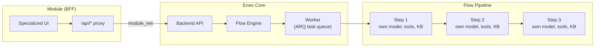
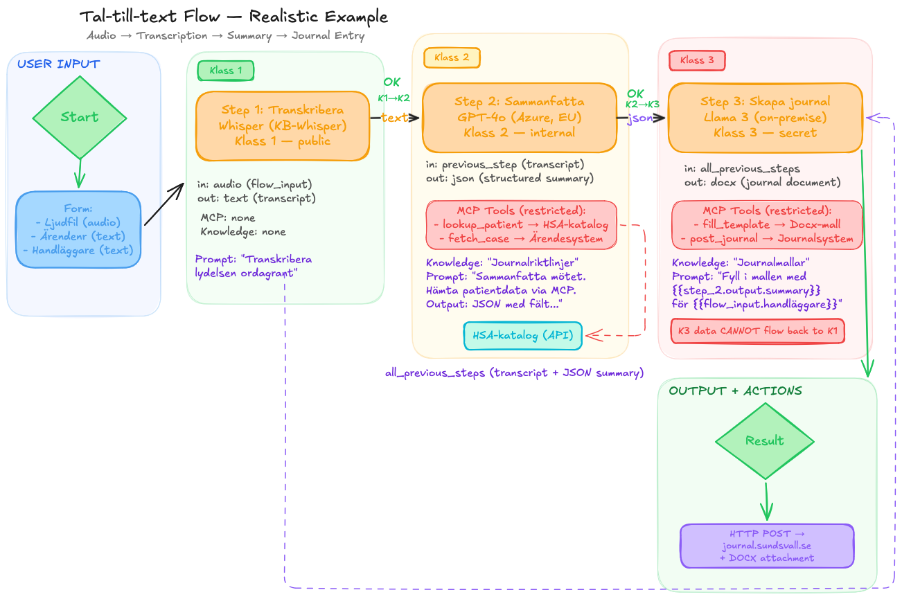
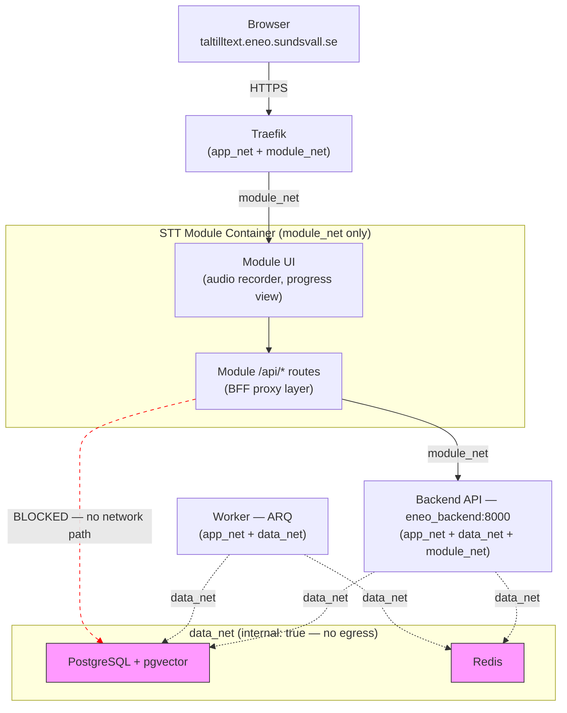
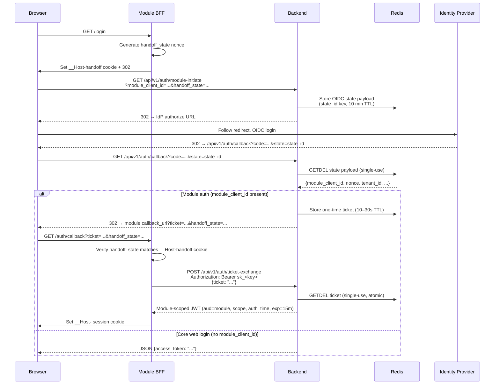
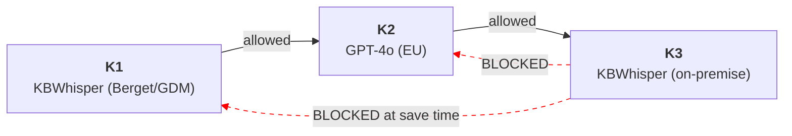

# Eneo Modules & Flows — Architecture Reference

Reference architecture for two new Eneo capabilities: **Flows** (sequential AI pipelines) and **Modules** (self-contained add-on services). This repo contains the design documents, Docker Compose configurations, and a worked example — a Speech-to-Text pipeline for municipal social services.

---

## Läsanvisning

Det här repot innehåller arkitekturdokumenten för Eneos nya funktioner: Flöden (sekventiella AI-pipelines) och Moduler (självständiga tilläggstjänster med BFF-mönster). Målsättningen är att ge teamet en gemensam bild av hur vi bygger säkra, granskningsbara AI-arbetsflöden för offentlig sektor. Börja med scenariot "Tal-till-text" längre ner — det gör resten av dokumentet konkret.

---

## What This Repo Contains

| File | For whom | What it covers |
|------|----------|----------------|
| [`ARCHITECTURE.md`](./ARCHITECTURE.md) | Architects, tech leads | The "Why" and the "Boundaries": [module system](./ARCHITECTURE.md#part-2-module-system-architecture), [auth broker](./ARCHITECTURE.md#part-3-authentication), [network model](./ARCHITECTURE.md#part-4-network-architecture), [widget embedding](./ARCHITECTURE.md#part-5-widget-architecture), [flow design](./ARCHITECTURE.md#part-6-sequential-flows-flöden), [decision matrix](./ARCHITECTURE.md#part-11-decision-matrix). |
| [`IMPLEMENTATION.md`](./IMPLEMENTATION.md) | Developers, architects | The "What" and the "When": [data model](./IMPLEMENTATION.md#1-data-model), [flow runner](./IMPLEMENTATION.md#5-sequentialflowrunner), [auth broker endpoints](./IMPLEMENTATION.md#13-auth-broker--ticket-handoff), [frontend](./IMPLEMENTATION.md#14-frontend-implementation), [7-PR delivery sequence](./IMPLEMENTATION.md#16-pr-sequence). |
| [`FLOW_EXECUTION_ENGINE.md`](./FLOW_EXECUTION_ENGINE.md) | Backend developers | The "How": [variable resolver](./FLOW_EXECUTION_ENGINE.md#variable-resolver-with-json-safe-escaping), [resume determinism](./FLOW_EXECUTION_ENGINE.md#resume-determinism-execution-hash), [SequentialFlowRunner](./FLOW_EXECUTION_ENGINE.md#sequentialflowrunner-manual-db-sessions), [SSRF protection](./FLOW_EXECUTION_ENGINE.md#ssrf--http-features-both-get-and-post), [security classification](./FLOW_EXECUTION_ENGINE.md#security-classification). |
| [`docker-compose.core.yml`](./docker-compose.core.yml) | DevOps, architects | Core infrastructure: Traefik, Frontend, Backend, Worker, PostgreSQL, Redis. Three-network isolation. |
| [`docker-compose.modules.yml`](./docker-compose.modules.yml) | DevOps, developers | Module overlay: how to add Speech-to-Text, Widget, or any new module. Zero changes to core. |
| `taltilltextflow.excalidraw.png` | Everyone | Visual diagram of the Speech-to-Text flow pipeline. |
| [`taltilltextflow.excalidraw`](./taltilltextflow.excalidraw) | Designers, architects | Editable diagram source (open with [excalidraw.com](https://excalidraw.com)). |

---

## The Big Picture

Here is the overall model. A **Flow** is a sequential AI pipeline. A **Module** is a standalone UI service (following the BFF — Backend For Frontend — pattern) that triggers flows via the backend API.



The module handles the user experience. The backend handles execution, security, and audit. The flow defines what each AI step does. These three concerns are independent — you can change the module UI without touching the flow, or modify a step's prompt without redeploying the module.

---

## The Scenario: Speech-to-Text (Tal-till-text)

A social worker in Sundsvall finishes a client meeting about welfare support. They recorded the audio. Today, turning that recording into a formal journal entry takes 45 minutes of manual work: transcribe, look up patient data, cross-reference guidelines, write the entry, post it to the journal system.

With an Eneo flow, it takes one button press. The user visits `taltilltext.eneo.sundsvall.se` (the STT module), uploads the audio, fills in case number and handler name, and hits "Kör flödet." Three AI steps execute in sequence:



*Editable source: [taltilltextflow.excalidraw](./taltilltextflow.excalidraw)*

### Step-by-Step Data Flow

Each step is an independent AI agent with its own model, prompt, tools, and security classification. Data flows strictly forward — Step 1 can never see Step 3's output.

```
╔════════════════════════════════════════════════════════════════════════════╗
║  STEP 1: Transkribera                                                      ║
║  Model:  KBWhisper (Berget/GDM)                                            ║
║  Klass:  1 (public — audio transcription is not sensitive)                 ║
╠════════════════════════════════════════════════════════════════════════════╣
║                                                                            ║
║  INPUT:   flow_input → audio file (meeting.mp3)                            ║
║  PROMPT:  "Transkribera lydelsen ordagrant på svenska."                    ║
║  MCP:     none                                                             ║
║  KNOWLEDGE: none                                                           ║
║                                                                            ║
║  OUTPUT (text):                                                            ║
║  "Anna: Hej, jag vill prata om ditt stödbehov framåt.                      ║
║   Klient: Ja, jag har haft svårt med vardagliga sysslor                    ║
║   sedan operationen i december..."                                         ║
║                                                                            ║
║  ── This raw transcript flows forward to Step 2 ──                         ║
║     Classification: K1 → K2 (escalation allowed)                           ║
╚════════════════════════════════════════════════════════════════════════════╝
                                    │
                                    ▼
╔════════════════════════════════════════════════════════════════════════════╗
║  STEP 2: Sammanfatta och berika                                            ║
║  Model:  GPT-4o (Azure, EU-hosted)                                         ║
║  Klass:  2 (internal — now we're adding personal identifiers)              ║
╠════════════════════════════════════════════════════════════════════════════╣
║                                                                            ║
║  INPUT:   previous_step → the transcript from Step 1                       ║
║                                                                            ║
║  PROMPT:  "Du är en journalassistent. Sammanfatta mötet i                  ║
║            strukturerat JSON-format. Hämta patientdata via                 ║
║            MCP-verktyget lookup_patient med ärendenummer                   ║
║            {{flow_input.ärendenr}}. Inkludera fält:                        ║
║            patient_id, summary, key_decisions, next_steps."                ║
║                                                                            ║
║  MCP TOOLS (restricted allowlist):                                         ║
║    ┌──────────────────┐    ┌──────────────────────┐                        ║
║    │ lookup_patient   │    │ fetch_case            │                       ║
║    │ → HSA-katalog    │    │ → Ärendesystem API    │                       ║
║    │   (staff + client│    │   (case history)      │                       ║
║    │    registry)     │    │                        │                      ║
║    └──────────────────┘    └──────────────────────┘                        ║
║                                                                            ║
║  KNOWLEDGE BASE: "Journalriktlinjer"                                       ║
║    (RAG retrieves relevant sections about how to structure                 ║
║     social service journal entries per Socialtjänstlagen ch. 11 §5)        ║
║                                                                            ║
║  OUTPUT (json):                                                            ║
║  {                                                                         ║
║    "patient_id": "P-198705-2341",                                          ║
║    "case_number": "2026-BIS-0847",                                         ║
║    "handler": "Anna Lindström",                                            ║
║    "summary": "Klienten beskriver fortsatta svårigheter...",               ║
║    "key_decisions": ["Utöka hemtjänst till 4x/vecka"],                     ║
║    "next_steps": ["Uppföljning 2026-03-15"],                               ║
║    "meeting_date": "2026-02-20"                                            ║
║  }                                                                         ║
║                                                                            ║
║  ── Structured JSON flows forward to Step 3 ──                             ║
║     Classification: K2 → K3 (escalation allowed)                           ║
╚════════════════════════════════════════════════════════════════════════════╝
                                    │
                                    ▼
╔════════════════════════════════════════════════════════════════════════════╗
║  STEP 3: Skapa journalanteckning                                           ║
║  Model:  KBWhisper (on-premise, sekretessdata)                             ║
║  Klass:  3 (secret — full journal with personal details)                   ║
╠════════════════════════════════════════════════════════════════════════════╣
║                                                                            ║
║  INPUT:   all_previous_steps                                               ║
║           ┌─────────────────────────────────────────────┐                  ║
║           │ <step_1>                                     │                 ║
║           │   Full transcript text...                    │                 ║
║           │ </step_1>                                    │                 ║
║           │ <step_2>                                     │                 ║
║           │   {"patient_id":"P-198705-2341",...}         │                 ║
║           │ </step_2>                                    │                 ║
║           └─────────────────────────────────────────────┘                  ║
║                                                                            ║
║  PROMPT:  "Fyll i journalmallen. Använd                                    ║
║            {{step_2.output.summary}} som sammanfattning.                   ║
║            Handläggare: {{flow_input.handläggare}}.                        ║
║            Patient: {{step_2.output.patient_id}}.                          ║
║            Inkludera ordagrant citat från transkriberingen                 ║
║            där klienten uttrycker sina behov."                             ║
║                                                                            ║
║  MCP TOOLS (restricted allowlist):                                         ║
║    ┌──────────────────┐                                                    ║
║    │ fill_template    │  ← fills a DOCX template with structured           ║
║    │ → Mallsystem     │     data from the JSON + transcript                ║
║    └──────────────────┘                                                    ║
║                                                                            ║
║  KNOWLEDGE BASE: "Journalmallar"                                           ║
║    (RAG retrieves the correct template format for                          ║
║     "Biståndshandläggning — Mötesanteckning")                              ║
║                                                                            ║
║  OUTPUT (docx):                                                            ║
║    → journalanteckning_2026-BIS-0847.docx                                  ║
║                                                                            ║
║  OUTPUT MODE: http_post                                                    ║
║    → POST https://journal.sundsvall.se/api/v1/entries                      ║
║      Body: {"case": "{{step_2.output.case_number}}",                       ║
║             "handler": "{{flow_input.handläggare}}",                       ║
║             "document_id": "{{step_3.output.file_id}}"}                    ║
║      Headers: {"Authorization": "Bearer sk_journal_xxx"}                   ║
║                                                                            ║
║  K3 data CANNOT flow backwards to K1 or K2 models                          ║
║  K3 output CANNOT be sent to external webhooks                             ║
║     (journal.sundsvall.se is internal → allowed)                           ║
╚════════════════════════════════════════════════════════════════════════════╝
```

After Step 3 completes, the generated DOCX is stored in Eneo (downloadable from the results tab) and simultaneously POSTed to the journal system. The user sees all three steps with green status indicators, execution times per step, and total token usage.

---

## Core Concepts

### Eneo Flows (Flöden)

A flow is a sequential AI pipeline: **Start → Step 1 → Step 2 → Step 3 → End**. Each step is a full AI agent with its own prompt, model, knowledge base, and MCP (Model Context Protocol) tools. Steps execute one after another — no loops, no branching, no conditional logic.

This is deliberate. Municipal processes are inherently linear (receive → analyze → decide → archive). A strict forward-only pipeline means every execution is fully auditable — you can export the exact sequence of what happened, what each model saw, and what it produced. Non-technical administrators can build and modify flows without understanding graph theory.

**What each step can do:**

- Use a different AI model (KBWhisper for audio, GPT-4o for reasoning, on-premise models for classified data)
- Access its own knowledge bases via RAG (Retrieval-Augmented Generation — the existing Eneo embedding pipeline is fully preserved)
- Call external APIs via MCP tools (each step has an independent tool allowlist)
- Read data from the original form input, the previous step, all previous steps, or an HTTP endpoint
- Output text, JSON, PDF, or DOCX

**Variable interpolation** connects the steps. A prompt can reference `{{flow_input.field_name}}` for form data or `{{step_2.output.summary}}` for a JSON field from a previous step's output. Variables are JSON-safe escaped to prevent injection in HTTP request bodies.

**Deep dive:**
- Variable resolver and JSON-safe escaping: [FLOW_EXECUTION_ENGINE.md — Variable Resolver](./FLOW_EXECUTION_ENGINE.md#variable-resolver-with-json-safe-escaping)
- Flow data model and aggregate root: [IMPLEMENTATION.md — Data Model](./IMPLEMENTATION.md#1-data-model)
- Input sources and resolution logic: [FLOW_EXECUTION_ENGINE.md — Input Resolution](./FLOW_EXECUTION_ENGINE.md#input-resolution)
- MCP tool restriction per step: [FLOW_EXECUTION_ENGINE.md — MCP Tool Resolution](./FLOW_EXECUTION_ENGINE.md#mcp-tool-resolution-safe-entity-cloning)

---

### Eneo Modules — The Architecture and Why It Matters

A module is a self-contained service that adds a specialized capability to Eneo. The Speech-to-Text module is the first example. The architecture is designed so that any team can build and ship a module without touching Eneo's core codebase.

**The problem modules solve:**

Without modules, every new capability (STT, document scanning, form builder, etc.) would need to be built directly into the Eneo backend and frontend. That means more code in the monolith, more coupling between features, longer CI pipelines, higher risk of regressions, and every team waiting on the same deploy cycle. Over time, this creates compounding technical debt — each feature makes the next one harder to ship.

**The BFF (Backend For Frontend) pattern:**



Each module is a standalone server that:

1. **Serves its own UI** at its own subdomain (e.g., `taltilltext.eneo.sundsvall.se`)
2. **Has its own `/api/*` routes** that proxy requests to the Eneo backend internally
3. **Runs in its own container** on the module network
4. **Cannot reach the database or Redis** — it can only talk to the backend API

The browser never communicates directly with the Eneo backend when on a module's domain. All requests go through the module's BFF layer, which adds domain-specific logic before forwarding to the backend.

> **Architecture details:** [ARCHITECTURE.md — BFF Pattern](./ARCHITECTURE.md#21-bff-pattern) and [Module Contract](./ARCHITECTURE.md#22-module-contract)

**Why this reduces technical debt and increases flexibility:**

- **Isolation.** A bug in the STT module cannot crash the core platform. A compromised module container cannot read the database.
- **Independent deployment.** The STT team ships on their own schedule. No coordination with the core team unless the backend API changes.
- **Opt-in activation.** Modules are enabled via Docker profiles (`--profile speech-to-text`). Municipalities that don't need STT don't run the container — zero resource cost, zero attack surface.
- **Clean contracts.** The backend API is the only interface between core and modules. This forces good API design and prevents the internal coupling that makes monoliths hard to change over time.
- **Zero core changes.** Adding a new module requires 8 steps, none of which touch `docker-compose.core.yml` or any backend code.

**Adding a new module in practice:**

1. Copy `modules/_template` to `modules/my-module`
2. Edit `module.json` (id, name, port)
3. Add service entry to `docker-compose.modules.yml`
4. Set domain in `.env`
5. Create an `sk_` API key in the admin UI (scoped, IP-restricted, rate-limited)
6. Add key to `env_modules.env`
7. Add to CI build matrix
8. Done — core remains untouched

**Authentication for modules:**

- **User-facing modules** (like STT): use **Auth Broker + Ticket Handoff**. The module BFF sets a temporary `__Host-handoff` state cookie before redirecting to `/api/v1/auth/module-initiate`, and validates the returned `handoff_state` before calling `ticket-exchange` (prevents callback/login CSRF).
- **User-context backend calls**: module BFF sends `Authorization: Bearer <module-scoped-jwt>`. Backend extracts `sub/aud/tenant_id/scope` from signed JWT claims (no custom user-id trust header).
- **System-context backend calls**: module BFF sends `Authorization: Bearer sk_<module_key>` (ticket exchange, health, anonymous widget operations).
- **Widget module** (public embed): primary security boundary is server-side `sk_` key scoping. CSP `frame-ancestors`, strict Origin/CORS checks, and edge rate limits are defense-in-depth.

**Auth Broker + Ticket Handoff sequence:**



> **Auth deep dive:** [ARCHITECTURE.md — Authentication](./ARCHITECTURE.md#part-3-authentication) | [IMPLEMENTATION.md — Auth Broker Endpoints](./IMPLEMENTATION.md#131-auth-broker-endpoints) | [IMPLEMENTATION.md — Module JWT & Refresh](./IMPLEMENTATION.md#134-module-jwt-claims-auth-patterns-and-refresh)

**Deployment posture:**

- **Docker Compose is the primary and fully supported model** for municipal environments (1–20+ modules).
- **Kubernetes is reference-only** for organizations that already run K8s and need advanced features (NetworkPolicies, rolling HA, multi-node orchestration).

> **Compose configuration:** [docker-compose.core.yml](./docker-compose.core.yml) (core services) | [docker-compose.modules.yml](./docker-compose.modules.yml) (module overlay)
> **Versioning and compatibility:** [ARCHITECTURE.md — Versioning, Compose, SDK](./ARCHITECTURE.md#part-79-versioning-compose-sdk)

### Why Two Safeguards Exist (Determinism + Compatibility)

This section explains the intent in plain language. If you need implementation details, use the direct links under each safeguard.

#### `flow_step_execution_hash` (resume determinism)

**Problem:** A flow fails on step 3, an editor changes prompts in step 1 and step 3, then clicks resume. If the system resumes from step 3 using old cached output from step 1, the run mixes old/new logic and becomes non-deterministic.

**Solution:** Each completed step stores `flow_step_execution_hash` from execution-critical fields only. On resume, backend compares upstream stored hashes against current definitions.

- If upstream logic or topology changed: rerun from step 1.
- If upstream logic is unchanged: resume from first failed step.

**Hashed (affects execution):** `assistant_id`, prompt text, `completion_model.id`, `mcp_policy`, restricted `mcp_tool_allowlist`, `input_source`, `input_config`, `output_mode`, `output_type`, `output_config`, `output_classification_override`.

**Not hashed (cosmetic):** `user_description`, icons, timestamps, UI-only rendering hints.

This prevents "Frankenstein runs" while avoiding unnecessary reruns from label/typo-only edits.

**Read more:**
- Hash semantics and resume rules: [FLOW_EXECUTION_ENGINE.md — Resume Determinism (Execution Hash)](./FLOW_EXECUTION_ENGINE.md#resume-determinism-execution-hash)
- API contract and acceptance checks: [IMPLEMENTATION.md — 13.4 Module JWT Claims, Auth Patterns, and Refresh](./IMPLEMENTATION.md#134-module-jwt-claims-auth-patterns-and-refresh)
- Architectural decision record: [ARCHITECTURE.md — Part 11: Decision Matrix](./ARCHITECTURE.md#part-11-decision-matrix)

#### `module_registry` extension fields (operator predictability)

`module_registry` now tracks compatibility metadata so operators can safely update one module without guessing cross-impact.

| Column | Purpose |
|------|---------|
| `module_version` | Shows what module version is actually running |
| `image_digest` | Pins exact deployed image (not only tag) |
| `module_api_contract` | Primary compatibility gate against core API contract |
| `core_compat_min` / `core_compat_max` | Advisory tested core-version range |
| `compat_status` | Computed status shown to operators (`compatible` / `incompatible` / `unknown`) |
| `release_notes_url` | Direct link to upgrade-change details |

**Operational flow:** module reports metadata via health/reconciliation, backend computes `compat_status`, admin sees exact compatibility reason before enabling/upgrading.

**Read more:**
- Compatibility and versioning model: [ARCHITECTURE.md — Part 7–9: Versioning, Compose, SDK](./ARCHITECTURE.md#part-79-versioning-compose-sdk)
- Data model fields and PR placement: [IMPLEMENTATION.md — 1.3 Module Registry Table](./IMPLEMENTATION.md#13-module-registry-table)
- Known operational boundaries: [ARCHITECTURE.md — Part 14: Known Limitations & V2 Boundaries](./ARCHITECTURE.md#part-14-known-limitations--v2-boundaries)

### Where to Go Next

- High-level architecture: [ARCHITECTURE.md](./ARCHITECTURE.md)
- Delivery/PR sequence and endpoint contracts: [IMPLEMENTATION.md](./IMPLEMENTATION.md)
- Flow engine behavior and hashing internals: [FLOW_EXECUTION_ENGINE.md](./FLOW_EXECUTION_ENGINE.md)

---

### Security Classification (Klass 1 / 2 / 3)

Swedish municipal data is classified into three levels:

| Level | Label | What it means | Model hosting |
|-------|-------|---------------|---------------|
| K1 | Public | Non-sensitive data | Any (including cloud) |
| K2 | Internal | Personal identifiers, internal deliberations | EU-hosted only |
| K3 | Secret | Full personal records, medical data, social service journals | On-premise only |

**Monotonic enforcement:** Data can only flow to models of equal or higher classification. K1 → K2 → K3 is allowed (escalation). K3 → K1 is blocked. This is validated when the flow is saved, not at runtime — if you try to create a flow where a K3 step feeds into a K1 step, the API rejects it immediately.



In the STT example: KBWhisper via Berget/GDM (K1) transcribes audio (not sensitive), GPT-4o (K2, EU-hosted) adds personal identifiers from the case system, KBWhisper on-premise (K3) produces the full journal entry with all personal data. Each step handles data at or above the classification of what it receives.

**MCP tool restriction per step:** Each step has a tool policy — either `inherit` (use all tools from the underlying assistant) or `restricted` (explicit allowlist only). Step 2 in the STT flow can call `lookup_patient` and `fetch_case`, but Step 3 cannot — even if the underlying assistant has those tools. Tools auto-execute within the pipeline; the allowed set is pre-configured by the flow administrator at design time.

> **Classification enforcement details:** [FLOW_EXECUTION_ENGINE.md — Security Classification](./FLOW_EXECUTION_ENGINE.md#security-classification)
> **MCP tool resolution internals:** [FLOW_EXECUTION_ENGINE.md — MCP Tool Resolution](./FLOW_EXECUTION_ENGINE.md#mcp-tool-resolution-safe-entity-cloning)

---

## Network Architecture

The platform runs on three Docker networks with strict isolation:

```
                          INTERNET
                             │
                    ┌────────┴────────┐
                    │     TRAEFIK     │
                    │  (reverse proxy)│
                    └──┬──────────┬───┘
                       │          │
 ┏━━━━━━━━━━━━━━━━━━━━━│━━━━━━━━━━│━━━━━━━━━━━━━━━━━━━━━━━━━━━━━━━━━━━━━━━━┓
 ┃  app_net             │          │                                       ┃
 ┃                      ▼          │                                       ┃
 ┃   ┌──────────┐  ┌──────────┐   │   ┌─────────────┐                      ┃
 ┃   │ Frontend │  │  Worker  │   │   │   Backend   │◄── bridges all 3     ┃
 ┃   │ (Svelte) │  │  (ARQ)   │   │   │  (FastAPI)  │    networks          ┃
 ┃   └──────────┘  └─────┬────┘   │   └──┬───────┬──┘                      ┃
 ┃                        │        │      │       │                        ┃
 ┗━━━━━━━━━━━━━━━━━━━━━━━━│━━━━━━━━│━━━━━━│━━━━━━━│━━━━━━━━━━━━━━━━━━━━━━━━┛
                          │        │      │       │
 ┏━━━━━━━━━━━━━━━━━━━━━━━━│━━━━━━━━│━━━━━━│━━━━━━━│━━━━━━━━━━━━━━━━━━━━━━━━┓
 ┃  data_net              │        │      │       │                        ┃
 ┃  (internal: true       ▼        │      ▼       │                        ┃
 ┃   — no egress)    ┌──────────┐  │  ┌────────┐  │                        ┃
 ┃                   │PostgreSQL│  │  │ Redis  │  │                        ┃
 ┃                   │+ pgvector│  │  └────────┘  │                        ┃
 ┃                   └──────────┘  │              │                        ┃
 ┗━━━━━━━━━━━━━━━━━━━━━━━━━━━━━━━━━│━━━━━━━━━━━━━━│━━━━━━━━━━━━━━━━━━━━━━━━┛
                                   │              │
 ┏━━━━━━━━━━━━━━━━━━━━━━━━━━━━━━━━━│━━━━━━━━━━━━━━│━━━━━━━━━━━━━━━━━━━━━━━━┓
 ┃  module_net                     ▼              ▼                        ┃
 ┃                                                                         ┃
 ┃   ┌─────────────────────┐  ┌─────────────────────┐                      ┃
 ┃   │   Speech-to-Text   │  │    Widget Host      │                       ┃
 ┃   │   (BFF module)     │  │   (BFF module)      │                       ┃
 ┃   │   → backend:8000   │  │   → backend:8000    │                       ┃
 ┃   └─────────────────────┘  └─────────────────────┘                      ┃
 ┃                                                                         ┃
 ┃   Modules call backend internally.                                      ┃
 ┃   Modules CANNOT reach PostgreSQL or Redis.                             ┃
 ┗━━━━━━━━━━━━━━━━━━━━━━━━━━━━━━━━━━━━━━━━━━━━━━━━━━━━━━━━━━━━━━━━━━━━━━━━━┛
```

**app_net** — Frontend, Backend, Worker, and Traefik. Outbound internet access allowed (for LLM APIs, OIDC providers, external webhooks).

**data_net** — PostgreSQL (with pgvector) and Redis only. Marked `internal: true` in Docker — no outbound internet, no routing to other networks. Only Backend and Worker are connected here. Modules, Frontend, and Traefik cannot reach the database.

**module_net** — Modules and Traefik. Each module can reach the Backend at `http://eneo_backend:8000`. In Docker Compose, modules share this network and can probe each other's internal ports; the real isolation boundary is auth (`sk_` scoping + module-scoped JWT `aud/scope`). Modules remain isolated from the data layer.

The Backend is the only service that bridges all three networks — the single gateway between the outside world, the data layer, and the modules. Even if a module container is compromised, the attacker has no path to the database.

> **Compose definitions:** [docker-compose.core.yml](./docker-compose.core.yml) (network declarations) | [docker-compose.modules.yml](./docker-compose.modules.yml) (module network attachment)
> **Architecture rationale:** [ARCHITECTURE.md — Network Architecture](./ARCHITECTURE.md#part-4-network-architecture)
> **Risk assessment:** [ARCHITECTURE.md — Risk Assessment](./ARCHITECTURE.md#part-13-risk-assessment)

---

## How the STT Module Fits In

The Speech-to-Text module is not the flow itself. It is a specialized UI wrapper around a standard Eneo flow:

```
 ┌────────────────────────────────────────────────────────────────┐
 │  Browser (taltilltext.eneo.sundsvall.se)                            │
 └──────────────────────────┬─────────────────────────────────────┘
                            │
                            ▼
 ┌────────────────────────────────────────────────────────────────┐
 │  STT Module (BFF)                                              │
 │                                                                │
 │  ├── Audio recorder widget, drag-and-drop upload               │
 │  ├── Custom progress visualization per step                    │
 │  ├── Domain-specific UX for social workers                     │
 │  │                                                             │
 │  └── /api/* routes (server-side) ─────────────────┐            │
 └────────────────────────────────────────────────────│───────────┘
                                                      │
                                                      ▼
 ┌────────────────────────────────────────────────────────────────┐
 │  http://eneo_backend:8000 (internal, via module_net)           │
 │                                                                │
 │  ├── POST /api/v1/flows/{id}/run    (trigger the flow)         │
 │  ├── GET  /api/v1/flow-runs/{id}    (poll for results)         │
 │  └── WebSocket                      (live step progress)       │
 └────────────────────────────────────────────────────────────────┘
```

The module provides the user experience. The backend provides the flow engine, security enforcement, and audit trail. If you wanted to build a different UI for the same flow — a mobile app, a different web design, an API-only integration — you would build a different module or call the backend API directly. The flow definition stays the same.

This separation is the core value of the module architecture: **the flow engine is generic, the user experience is specialized.**

> **STT module compose config:** [docker-compose.modules.yml](./docker-compose.modules.yml)
> **Flow runner internals:** [FLOW_EXECUTION_ENGINE.md — SequentialFlowRunner](./FLOW_EXECUTION_ENGINE.md#sequentialflowrunner-manual-db-sessions)
> **Worker task and cleanup:** [IMPLEMENTATION.md — Worker Task](./IMPLEMENTATION.md#9-worker-task)

---

## Further Reading

- **[ARCHITECTURE.md](./ARCHITECTURE.md)** — The "Why" and the "Boundaries". Module system, auth broker theory, network architecture, widget embedding, flow engine, and all key architectural decisions.

- **[IMPLEMENTATION.md](./IMPLEMENTATION.md)** — The "What" and the "When". Database schema, API endpoints, auth broker implementation, worker tasks, frontend components, and the 7-PR delivery sequence.

- **[FLOW_EXECUTION_ENGINE.md](./FLOW_EXECUTION_ENGINE.md)** — The "How". Variable resolution, classification validation, SequentialFlowRunner, SSRF protection, short-lived DB transactions, and codebase alignment fixes.

- **[docker-compose.core.yml](./docker-compose.core.yml)** — Core infrastructure. Defines the three-network model and all core services. This file never changes when adding modules.

- **[docker-compose.modules.yml](./docker-compose.modules.yml)** — Module overlay. STT and Widget module configs, plus step-by-step instructions for adding new modules.
